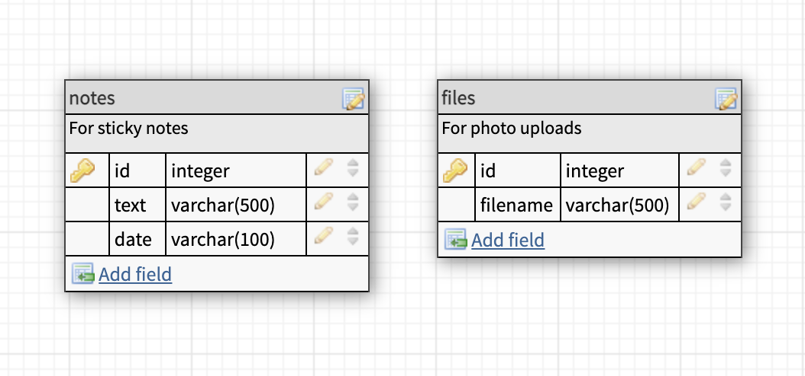
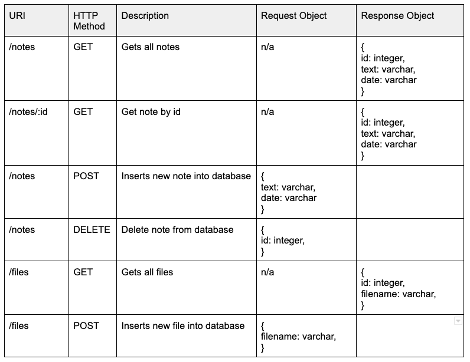

# Heart2Heart Dash App

Using the technologies of React, Node/Express, and MySQL, to add and display travel reviews to assist in the travel adventures of solo women travellers.


## Setup

### Dependencies

Run `npm run install` in the project folder to install dependencies related to Express (the server).

Run `npm install react-icons` in the project folder to install the react icon package which will provide the icons used within the app

`cd client` and run `npm run install` install dependencies related to React (the client).

### Database Prep

- Access the MySQL interface in your terminal by running `mysql -u root -p`
- Create a new database called reviews: `create database reviews`
- Add a `.env` file to the project folder of this repository containing the MySQL authentication information for MySQL user. For example:

```bash
  DB_HOST=localhost
  DB_NAME=h2hdash
  DB_USER=root
  DB_PASS=YOURPASSWORD
```

- Run `npm run migrate` in the project folder of this repository, in a new terminal window. This will create a table called "notes" and "files" in your database.

- In your MySQL console, you can run `use notes;` and then `describe notes;` to see the structure of the notes table.




### Run Your Development Servers

- Run `npm start` in project directory to start the Express server on port 5000
- In another terminal, do `cd client` and run `npm start` to start the client in development mode with hot reloading in port 3000.
- You can test your client app in `http://localhost:3000`
- You can test your API in `http://localhost:5000/api`

## Notes

For the powerpoint presentation: `https://docs.google.com/presentation/d/1y_rAeFDhkDqVLgP6kRaHsAGazoeSCtTsTjWnncQQ7Zc/edit?usp=sharing`

Please find below a few additional notes:


4.) For TravelAdvisory.js (Travel Advisoriy page), the API searches based off ISO Country Alpha-2 codes `https://www.iban.com/country-codes`
No API key is necessary.

_This is a student project that was created at [CodeOp](http://CodeOp.tech), a full stack development bootcamp in Barcelona._