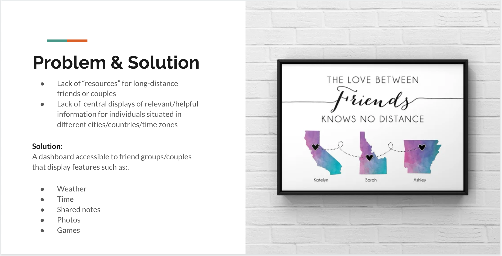

# Heart2Heart Dash App

A MVP from CodeOp's Full-Stack program, leveraging off front-end technologies such as React and React Router, along with CSS and Bootstrap for design. Back-end technologies of Node.js and Express were used, to connect client to server/database. Additional technologies used include Postman to test routes and MySQL for database creation. 

The purpose of the app is to facilitate long distance friendships/relationships - enabling groups of friends/couples to view at a glance the time and weather in their respective cities/countries. A notes component allows individuals to leave notes/thoughts for each other, while the photo carousel explains itself well enough. Finally you have the LuckGame component which is just a fun feature that displays a country at random upon being played - perhaps suggesting to said group of friends/couples where they should reunite next.




## Setup

### Dependencies

Run `npm run install` in the project folder to install dependencies related to Express (the server).

There are additional node packages installed for purpose of both functionality and design. Please install them for optimal performance as listed below:
- Run `npm install react-icons` in the project folder to install the react icon package which will provide the icons used within the app.

`cd client` and run `npm run install` install dependencies related to React (the client).

### Database Prep

- You will need a MySQL server, if you do not have one already please see `https://dev.mysql.com/doc/mysql-installation-excerpt/5.7/en/installing.html` for installation information.
- Access the MySQL interface in your terminal by running `mysql -u root -p`
- Create a new database called h2hdash: `create database h2hdash`
- Add a `.env` file to the project folder of this repository containing the MySQL authentication information for MySQL user. For example:

```bash
  DB_HOST=localhost
  DB_NAME=h2hdash
  DB_USER=root
  DB_PASS=YOURPASSWORD
```
- Run `npm run migrate` in the project folder of this repository, in a new terminal window. This will create a table called "notes" and "files" in your database.

- In your MySQL console, running `SHOW DATABASES;` will show you all available databases in your MySQL. 
  - Select the relevant database by running `USE h2hdash;`. 
  - Running `DESCRIBE notes;` in your MySQL console will allow you to see the structure of the notes table. 
    - Running `SELECT * FROM notes;` in your MySQL console will show you any available notes in table (note that init_db.sql in the model folder will have inserted placeholder data)
  - You can also run `describe files;` in your MySQL console to see the structure of the files table. 
    - Running `SELECT * FROM files;` in your MySQL console will show you any available files in the table (note in this case, no placeholder data)
  As an additional reference, see Database Schema below.
    - Notes and files database are not related/linked.
    


### Run Your Development Servers

- Run `npm start` in project directory to start the Express server on port 5000.
- In another terminal, do `cd client` and run `npm start` to start the client in development mode with hot reloading in port 3000.
- You can test your client app in `http://localhost:3000`
- You can test your API in `http://localhost:5000/notes` (only notes has placeholder data)

## Notes

For the powerpoint presentation: `https://docs.google.com/presentation/d/1nVVAdGVKhm9vmepxa3nP_Z-Hfvq_Vk3utvQpXtnDnq4/edit?usp=sharing`

Please find below a few additional notes:

1.) There are 4 main sections to the app:
- TimeWeatherView in the views folder. For components, TimeWeather has it's own folder that consists of:
  - CityField.js and CityField.css
  - TimeWeather.js and TimeWeather.css
- NotesView in the views folder. For components, NotesView consists of:
  - NotesForm.js and NotesForm.css
  - NotesList.js and NotesList.css
  - Search.js and Search.css
- PhotoCarouselView in the views folder. For components, Photocarousel has it's own folder that consists of:
  - CarouselItem.js and CarouselItem.css
  - CarouselControls.js and CarouselControls.css
  - CarouselIndicators.js and CarouselIndicators.css
    - Please note that while UploadForm.js and UploadForm.css are technically separate components in themselves, they have been included in the PhotoCarousel component as their main function is to allow photos to be uploaded
- LuckGameView does not have any components, all relevant functions have been coded into LuckGameView.js and it's corresponding CSS LuckGameView.css

2.) Please note that all uploaded files/images are stored in the public/clientfiles folder.

3.) There are a few items/folders that you can disregard:
- the Extras folder under the Components folder (these were components that were created but not utilised_
- index.js in the routes folder (this was a template route file)

_This is a student project that was created at [CodeOp](http://CodeOp.tech), a full stack development bootcamp in Barcelona._